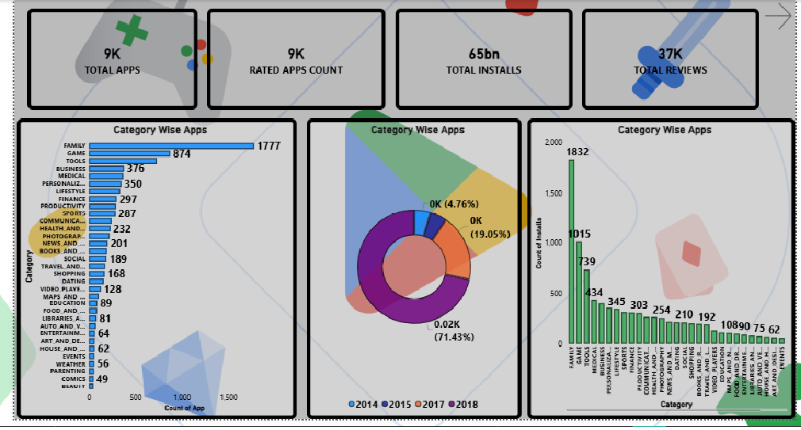
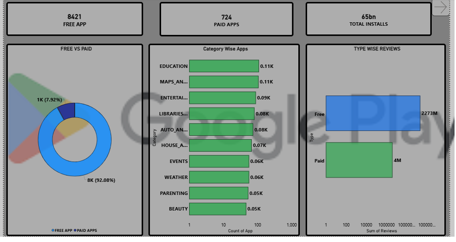
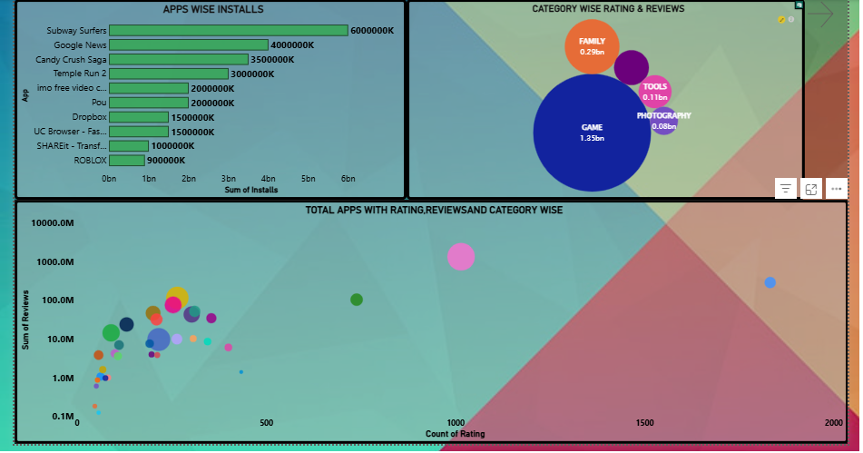
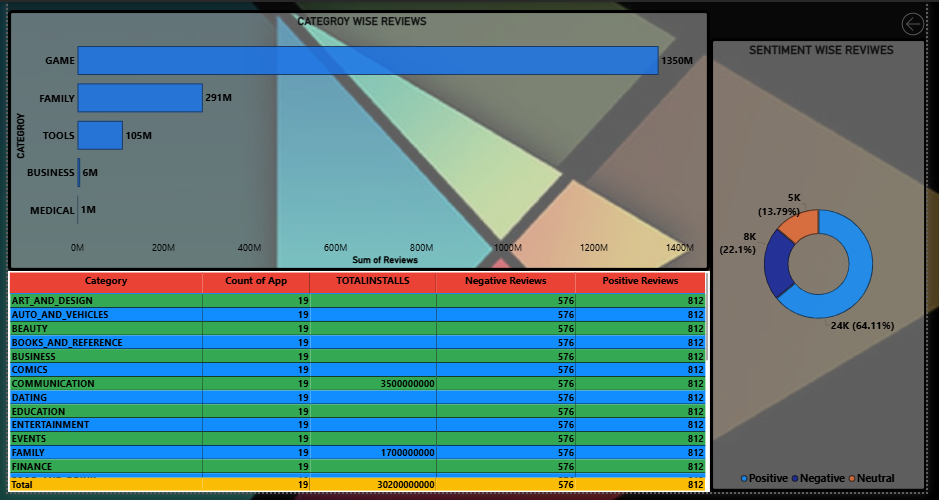

# Google Play Store Analytics Dashboard

## Overview
An interactive Business Intelligence dashboard exploring Google Play Store app data, covering app volume, install performance, category distribution, ratings, reviews, pricing type, and review sentiment.

## Dataset
Google Play Store application dataset (~9,000 apps), with dashboard-level KPIs of ~65bn total installs and 37K total reviews. Fields include category, app name, installs, ratings, review counts, pricing type, and sentiment.

## Tools
- **Power BI** — data modeling, DAX measures, and dashboard development
- **Gamma** — presentation deck creation

*Note: This project's data preparation and modeling were performed directly within Power BI — no separate Python scripting was used.*

## Steps
1. Loaded and inspected the app dataset in Power BI
2. Performed exploratory analysis on category distribution, installs, ratings, and reviews
3. Cleaned and standardized category, pricing, install, rating, and review fields
4. Built a clean analytical data model (star-schema style)
5. Created DAX measures for total apps, installs, reviews, free vs. paid apps, and sentiment breakdowns
6. Designed a 4-page interactive dashboard with KPI cards, bar charts, donut charts, and a bubble/scatter relationship view
7. Documented findings in a written report
8. Created a summary presentation using Gamma

## Dashboard
- **Page 1 — Executive Overview:** KPI cards (Total Apps, Rated Apps, Total Installs, Total Reviews), category-wise app count, category distribution by year

  
  
  
- **Page 2 — App Performance:** Top apps by installs, category-level rating/review comparison, rating-vs-review relationship view

  
- **Page 3 — Pricing & Category:** Free vs. paid app distribution, category-wise app counts, review volume by app type

  
- **Page 4 — Reviews & Sentiment:** Category-wise review totals, detailed category table, sentiment distribution (positive/negative/neutral)

## Results
- **Family** and **Game** were the largest app categories by count
- Install activity was highly concentrated among a few top apps (Subway Surfers, Google News, Candy Crush Saga)
- Free apps dominated the inventory (8,421 free vs. 724 paid) and review volume
- Review sentiment split: **64.11% positive, 22.1% negative, 13.79% neutral**

## How to Run
1. Load the Google Play Store dataset into Power BI
2. Apply the data-cleaning and modeling steps described in the report
3. Recreate the DAX measures listed in the report
4. Open the `.pbix` file to explore the interactive dashboard
5. Refer to the PDF report and Gamma slides for full findings

